# Talk 2: Introduction to Github

## Today's talk is about Github (not Git)

**Git** is a powerful, distributed, version control system:

- for managing a history of changes to files (often program text files)

    - "snapshots" (commits) of a folder and its contents a different points in time
       
- same project can be worked on by many people at the same time, on different computers ...

- developed to make it easy for many programmers to contribute to the developemnt and continual improvement of Linux

    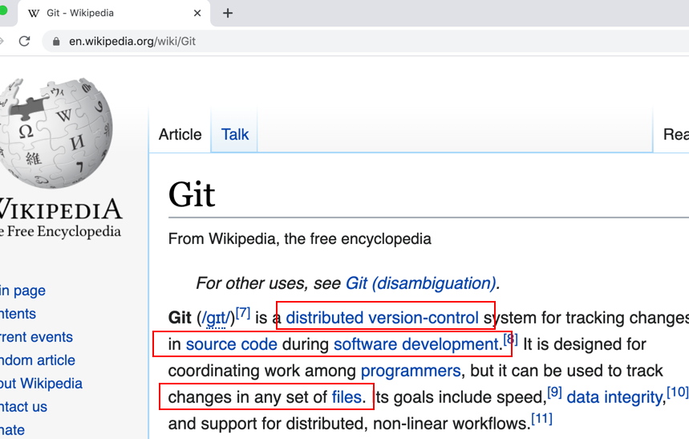
        
## Github

Github is:

- online hosting system for Git projects

    - so this is a free way for students to BACKUP a project to the cloud
    
    - no more "my hard drive crashed/computer got a virus ..."

- access control public/private, add collaborators

- issues (bug-tracking / lecturer feedback ...)

- CI (Continous Integration) - automated testing when new "commit" snapshot is pushed upto Github server

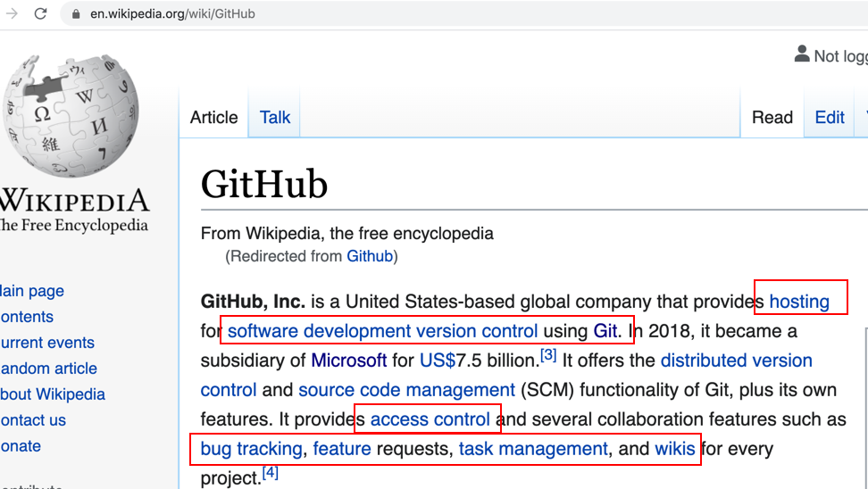
        
## Github simple use

- a way for students to securely share files/folders with lecturer via a URL

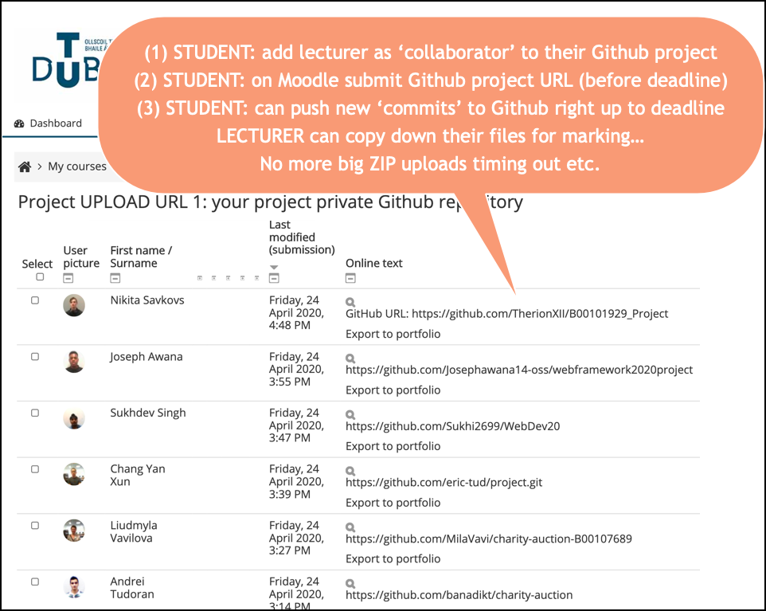

Potential new use:

- a way for students/lecturers to collaborate on a project in real-time (Gitpod & Github Codespaces...)

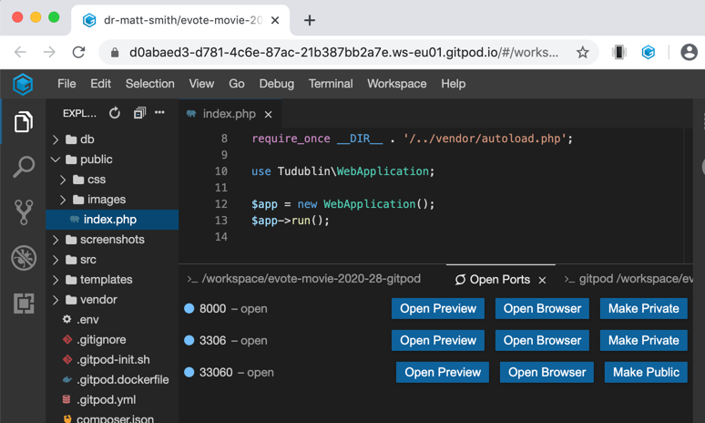

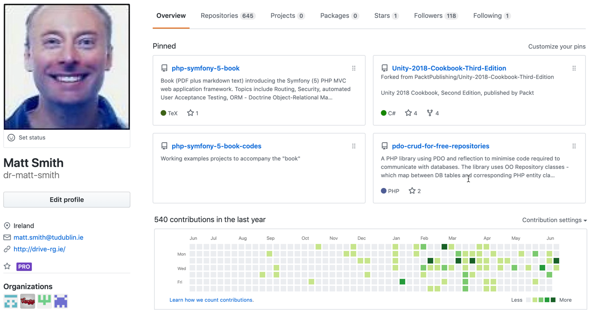

## New repository

Once logged into Github, can create new project easily

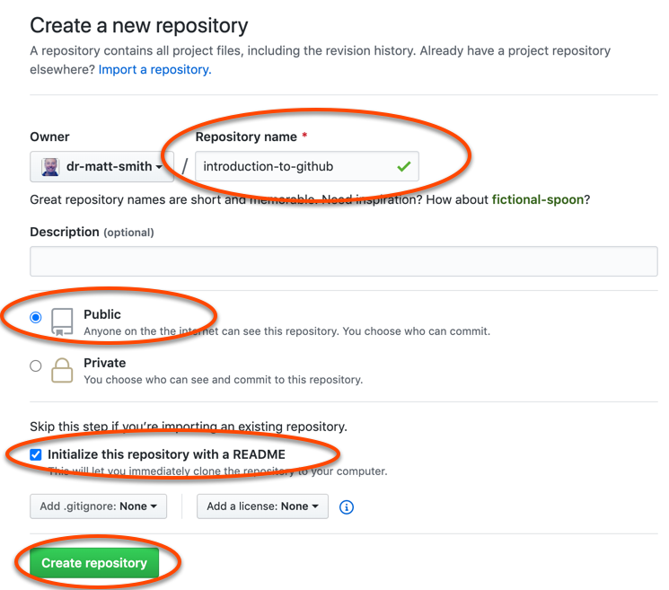

## Same pattern to Github URL

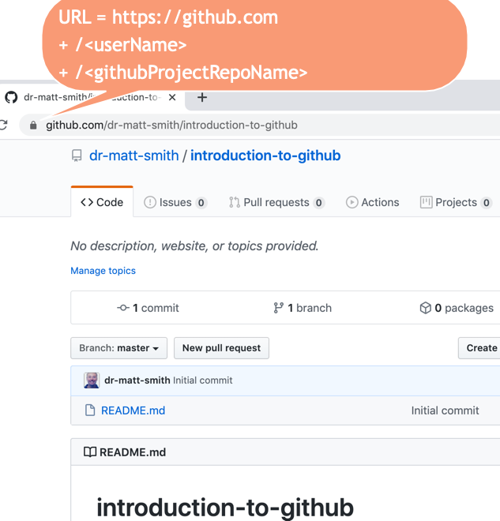

## Final year students

I ask final year / 3rd year project students to create 2 Github projects

- one for their code/system

- one for their thesis

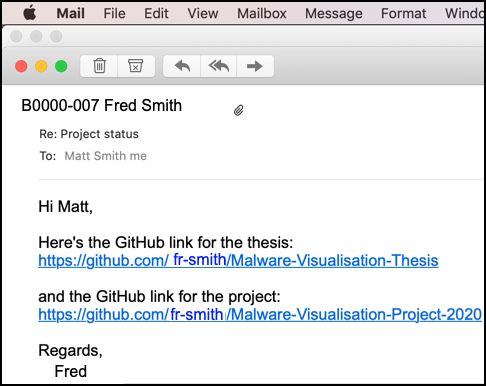

Github has an "issues" system, for raising problems / suggested changes as a kind of "todo" list for a project / document.

Great for giving students a list of feedback items, for reports and code projects

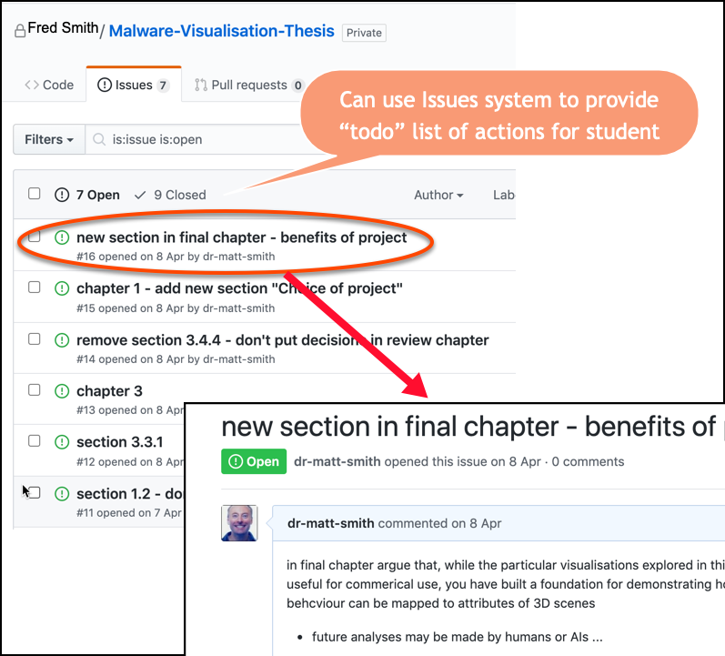

I ask students to write thesis/report written in text "markdown" files, using Pandoc to use LaTex to generate perfectly formatted and referenced thesis PDFs

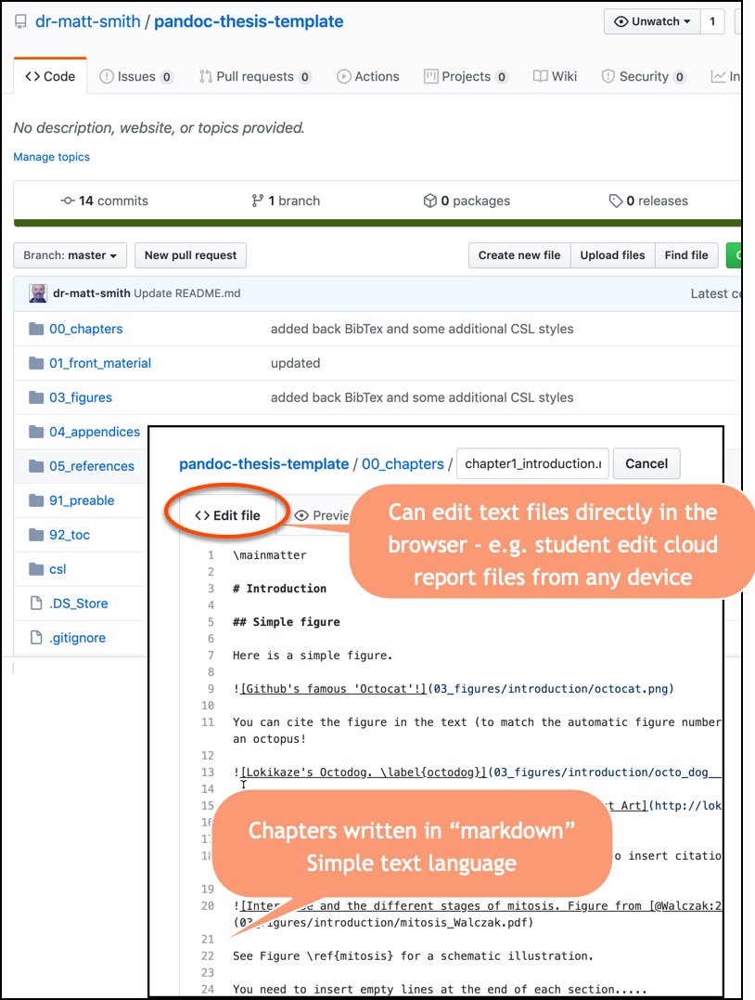

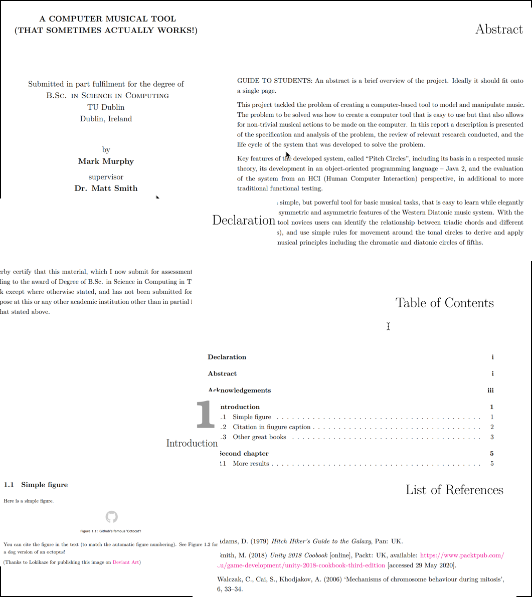

## Github/Gitlab/Bitbucket online CVs for software graduates

Employers of computing graduates will expect Git skills, and a Github or similar profile, so they can see what projects and style/quality of coding the students have published.

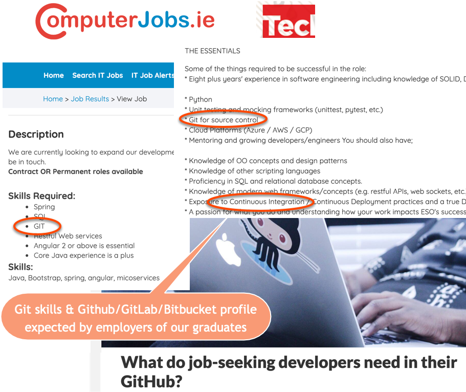

## Github Education pack

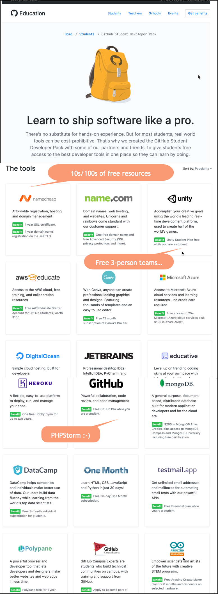

## This talk - uploaded to Github for sharing ..

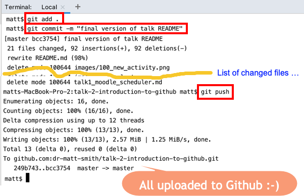
