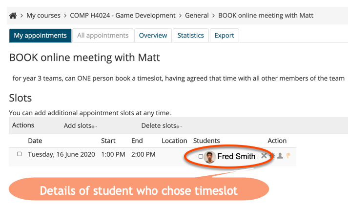

# Talk 1: Moodle Scheduler

## Introduction

The Moodle **Scheduler** is a Moodle tool allowing staff to create timetslots for given days/times, to which students can sign up.

Here is an example for fictional student **Fred Smith**:

---

## Advantages

I've found several advantages to using the Moodle scheduler:

1. In pre-Covid times, I used it in weeks 11 & 12 to schedule project grading one-to-ones with students. E.g. I'd:

    - book a meeting room for a few hours
    - add timeslots for that room to the Moodle scheduler
    - ask students to sign up for a timeslot for their 15-minute project defence
    
1. In Covid-times the scheduler has been useful for:

    - arranging online project supervision meetings
    
        - a student (or one from a team) sign up to a meeting timeslot
        
        - I had a single Adobe connect Meeting room I used for all supervision meetings, so they all know the URL to visit
        
    - offering students a chance for one-to-one code debugging sessions following an online lecture etc.
    

